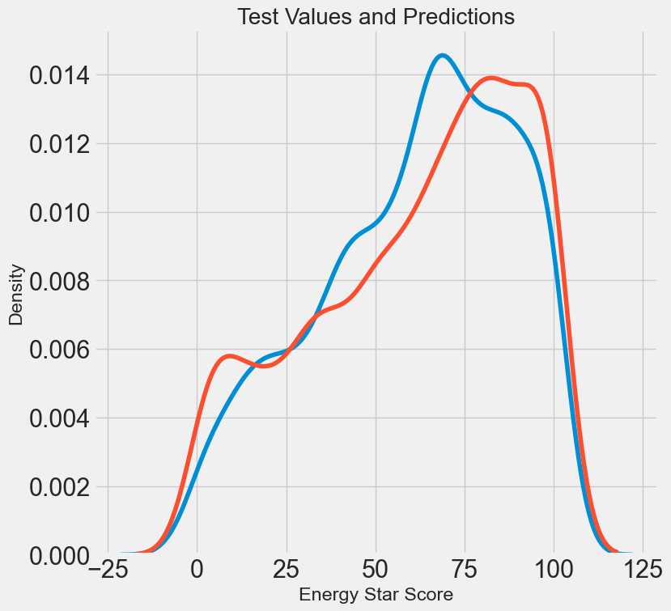
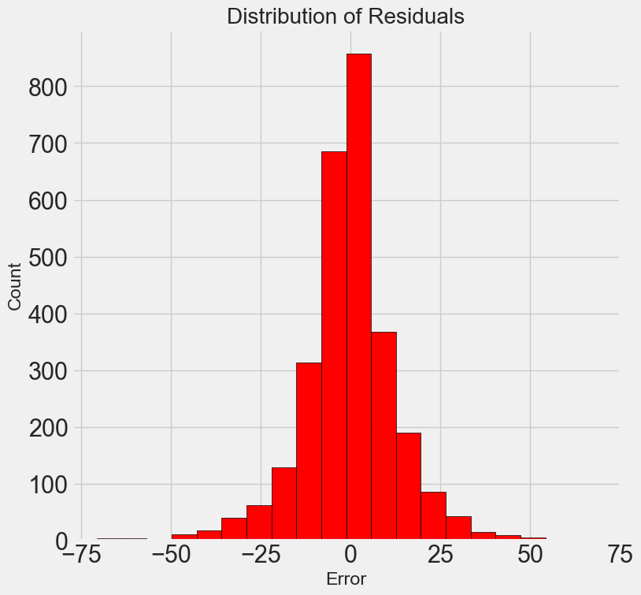

# Predict the Energy Star Scores for buildings in NYC

## 📌 Project Overview

This project involves using machine learning techniques to predict the Energy Star Scores for buildings in New York City. The Energy Star Score measures the energy efficiency of a building relative to similar buildings nationwide, and our task is to predict this score accurately based on various features.

## 📊 Model Performance Evaluation

To showcase the model's predictive capabilities, we've included visualizations that demonstrate how well our model performs on the test set.

### Distribution Comparison: True vs Predicted Values



The distribution plot shows that our model's predictions closely follow the true Energy Star Score distribution. While the predicted values align well with the overall pattern, they tend to cluster closer to the median rather than capturing the extreme values (like the peak at 100). This suggests the model is more conservative in its predictions, which can be beneficial for avoiding overfitting but may underestimate buildings with very high or very low scores.

### Residual Analysis



The residual histogram demonstrates that our model's prediction errors are well-distributed around zero, indicating balanced performance. The residuals follow a near-normal distribution with most errors being small and symmetric. However, there are some noticeable outliers on the lower end, representing cases where the model significantly underestimated the true Energy Star Score. These outliers provide valuable insights for potential model improvements and highlight areas where the model might need additional training data or feature engineering.

These visualizations confirm that our machine learning pipeline successfully captures the underlying patterns in building energy data while maintaining reasonable prediction accuracy across the range of Energy Star Scores.

# 📁 Project Structure
```
.
├── README.md
├── auto_ml
│   └── tpot_exported_pipeline.py
│       └── This Python script contains a machine learning pipeline automatically generated by TPOT, the Tree-based Pipeline Optimization Tool. TPOT is a genetic programming-based AutoML tool that automatically searches for the best ML pipeline using scikit-learn components.
├── data
│   └── Original and processed datasets used for model training/testing.
├── notebooks
│   ├── machine_learning_part1.ipynb (Data Cleaning, EDA, Feature Engineering)
│   ├── machine_learning_part2.ipynb (Model Comparison, Hyperparameter Tuning, Evaluation)
│   └── machine_learning_part3.ipynb (Model Interpretation, Conclusions, Reporting)
├── reports
│   └── PDF documentation and data definitions.
└── requirements.txt
    └── Python dependencies for reproducing the environment.
```
### 📊 **Dataset Metadata**

**Context:**

* Dataset includes energy and water usage data reported by New York City buildings under **Local Law 84 (LL84)** for benchmarking purposes.
* Maintained and published by the **New York City government** to encourage transparency and improvements in energy efficiency and sustainability in buildings.

**Content:**

* **Geography:** New York City, USA
* **Time Period:** Calendar Year 2016 (reported in 2017)
* **Unit of Analysis:** Individual buildings (private and city-owned)
* **Variables:** Energy Star Score, building size, building type, borough, energy usage intensity (EUI), electricity usage, water consumption, greenhouse gas emissions, and occupancy details.
* **Data Sources:** Self-reported by building owners/managers and verified by NYC authorities under LL84 benchmarking guidelines.

**Primary Source:**

* [NYC Open Data Portal - Energy and Water Data Disclosure for Local Law 84](https://data.cityofnewyork.us/Environment/Energy-and-Water-Data-Disclosure-for-Local-Law-84-/utpj-74fz)


## 🔧 Setup and Installation Instructions

### ⚙️ Compatibility

This project is specifically designed for **Python 3.10**. Ensure that you have Python 3.10 installed to avoid compatibility issues.

The project has been thoroughly tested on the following operating systems:
- **macOS** 
- **Linux Ubuntu** (20.04 and 22.04)

For other environments, results may vary, and additional setup might be required.

### 💻 Recommended Environment

As this is a compute-heavy task, it is recommended to use a cloud-based service with sufficient computational resources for optimal performance. Services such as **Google Colab**, **AWS**, or **Azure** can provide the necessary infrastructure to handle the intensive computations required for this project.

### Step 1: Download Project Files

Run the following command in your local terminal to download the project:

```bash

```
### Step 2: Setup Virtual Environment

Create and activate a virtual environment:

```bash
python3 -m venv .venv
source .venv/bin/activate   # Windows: .venv\Scripts\activate
```

### Step 3: Install Dependencies

Install necessary Python packages:

```bash
pip install --no-cache-dir -r requirements.txt
```

## 📈 Step-by-Step Guide

# Part 1: Data Preparation and Exploration

**Run jupyter notebook for the Part 1 `notebooks/machine_learning_part1.ipynb`**

## 1. Data Cleaning and Formatting

* Loaded and inspected the dataset, identified missing values, and irrelevant data.
* Removed features that contained a large proportion of missing values (>50%).
* Dealt with categorical variables and formatted them appropriately for analysis.

## 2. Exploratory Data Analysis (EDA)

* Explored the distribution and relationships between variables using visualizations.
* Identified and analyzed outliers and their potential impact on modeling.

## 3. Feature Engineering and Selection

* Created new features from existing data to improve model performance (e.g., logarithmic transformations of skewed data).
* Evaluated and reduced features by analyzing correlations and multicollinearity.
* Selected relevant features based on their potential influence on the Energy Star Score.

## 4. Establishing a Baseline

* Set a baseline prediction using a simple naive method (predicting the median Energy Star Score).
* Defined evaluation metrics (Mean Absolute Error - MAE) to measure model accuracy clearly and consistently.

# Part 2: Model Building and Comparison
**Run jupyter notebook for the Part 2 `notebooks/machine_learning_part2.ipynb`**

In the second notebook, you built and evaluated multiple machine learning models:
## 1. Preparing Data for Modeling

* Handled missing data through median imputation to ensure no data gaps.
* Applied feature scaling (Min-Max scaling) to normalize data for effective model training.

## 2. Model Evaluation

* Evaluated multiple machine learning models:

  * Linear Regression
  * Support Vector Machine (SVM)
  * Random Forest
  * Gradient Boosting
  * K-Nearest Neighbors (KNN)

* Each model's performance was compared using Mean Absolute Error (MAE), and Gradient Boosting emerged as the best-performing model.

# Part 3: Model Optimization and Validation
**Run jupyter notebook for the Part 3 `notebooks/machine_learning_part3.ipynb`**


In the final notebook, you focused on optimizing and validating the best-performing model from Part 2 (Gradient Boosting):

## 1. Hyperparameter Tuning

* Conducted hyperparameter optimization using Random Search with Cross-Validation, identifying the optimal settings for:

  * Loss function
  * Number of estimators (trees)
  * Tree depth
  * Minimum samples for splits and leaves
  * Feature selection strategy

## 2. Performance Optimization

* Evaluated the influence of the number of estimators (trees) on model performance to find the best balance between accuracy and model complexity.

## 3. Final Model Evaluation

* Tested the optimized model on an unseen test set to realistically estimate its predictive capability.
* Compared final model performance against a simpler baseline and default model configurations, demonstrating a substantial improvement.


### Step 4 ML Pipeline
```bash
 python3 auto_ml/tpot_exported_pipeline.py
```

This Python script is designed to accurately predict **Energy Star Scores** for buildings by utilizing a robust and optimized **Machine Learning Pipeline**. Its main objective is to demonstrate advanced methods for enhancing predictive accuracy, reliability, and consistency through careful model selection and tuning.

**Machine Learning Pipeline**

The pipeline employs a **stacked modeling technique**, combining multiple models to leverage their individual strengths.

- **Feature Selection Model**: Uses `LassoLarsCV` to simplify and identify the most predictive variables.
- **Regression Model**: Applies `Gradient Boosting Regressor`, known for handling complex, non-linear relationships effectively.

This structured pipeline ensures improved model accuracy and reduces the risk of overfitting.

**Model Training and Predictions**

- The optimized pipeline is trained on the prepared training dataset, enabling it to learn underlying patterns from historical building energy data.
- After training, it generates predictions on an unseen **test dataset** to simulate real-world application.

These predictions help assess how well the model generalizes to new data, which is critical for validating its effectiveness and reliability.


## 📊 Project Results Summary

The goal of this machine learning project was to predict the **Energy Star Score** of New York City buildings using real-world energy usage data. After executing the end-to-end ML pipeline—data cleaning, feature engineering, model selection, hyperparameter tuning, and evaluation—we achieved the following results:

### ✅ Key Results

#### Model Performance
* The final machine learning model is able to predict the Energy Star Score within an average error of **±10 points**, demonstrating strong predictive capability on the test set.
#### Reproducibility and Code Quality
* All steps were documented using **Jupyter Notebooks**
* Code was modularized and thoroughly **commented** for clarity and future reusability
